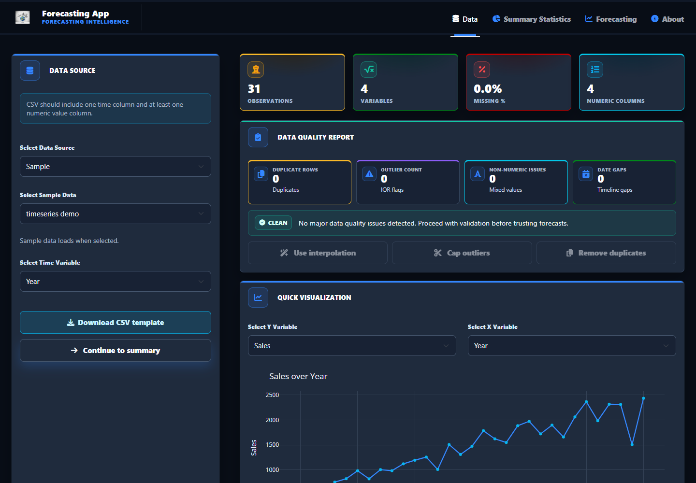
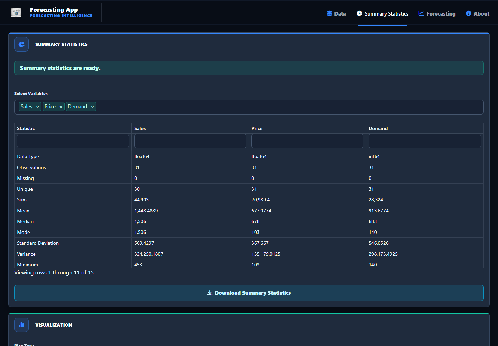
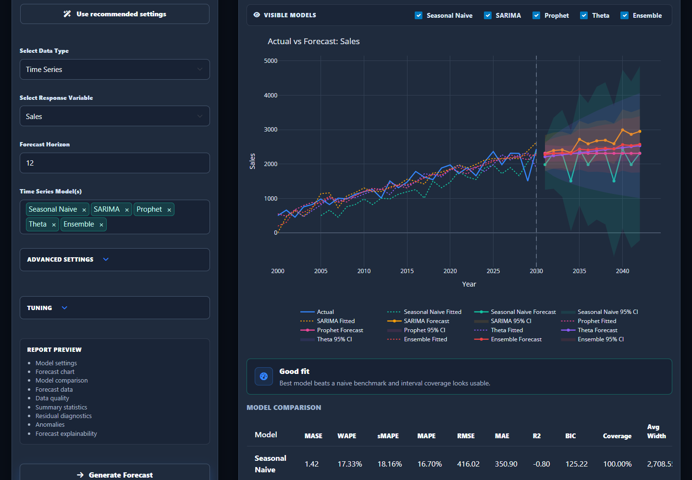
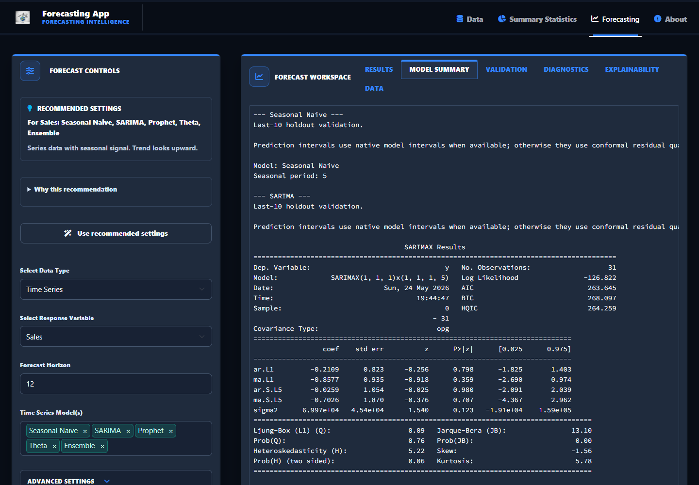
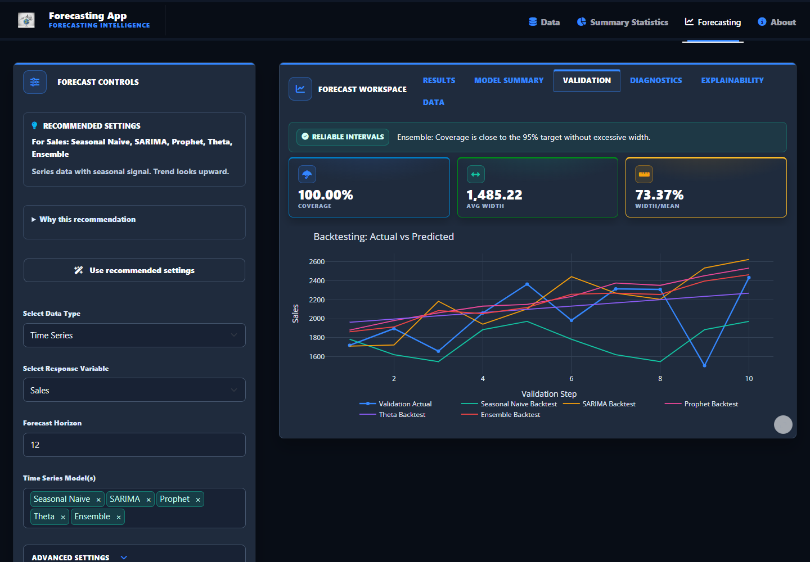
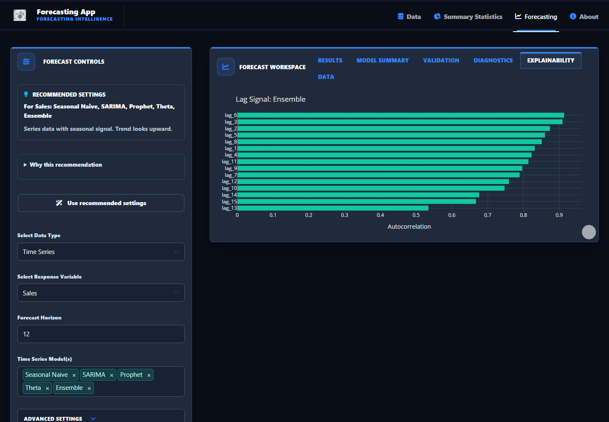

# Demo

This page shows the app workflow using the bundled sample dataset.

## Local Run

```bash
python -m pip install -e ".[dev]"
python -m shiny run app/app.py --reload --port 8000
```

Open `http://localhost:8000`.

## Screenshots

### Data Quality



### Summary Statistics



### Forecast Workspace



### Model Summary



### Validation



### Explainability



## Walkthrough

1. Load the bundled sample data from `app/timeseries_demo.csv`.
2. Open the data quality view and show missing value, duplicate, outlier, and date-gap checks.
3. Switch to the forecasting tab.
4. Select `Sales` as the response variable.
5. Apply recommended settings or choose a mix of models such as `Seasonal Naive`, `SARIMA`, `Prophet`, `Theta`, and `Ensemble`.
6. Generate the forecast and show the visible-model filter, forecast chart, and best-model card.
7. Open the model summary, validation, diagnostics, explainability, and data tabs.
8. Export forecast results or the HTML report.

## Profile Pinning

After pushing the polished repo, pin it on your GitHub profile if it represents your current best work:

1. Go to your GitHub profile.
2. Select **Customize your pins**.
3. Choose this repository.
4. Keep the README screenshot and setup instructions current.
